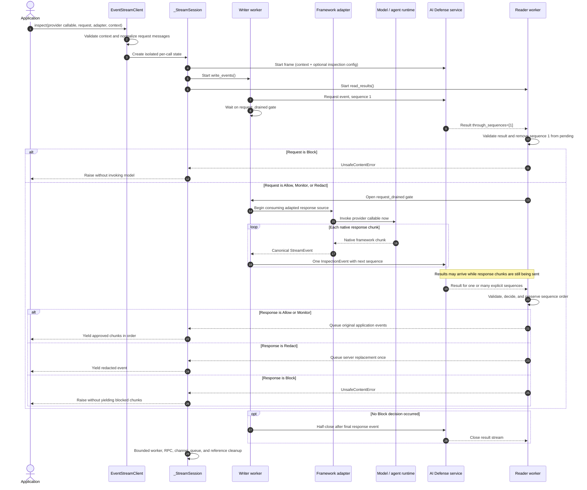

# AI Defense bidirectional event-stream client

This package provides the high-level Python interface for the AI Defense
bidirectional gRPC inspection API. Applications send ordinary framework events
through an adapter and receive only content that has an applicable server
decision. Normal integrations do not construct protobuf frames.

The feature intentionally lives in this nested ``event_stream`` package because
it combines a transport, protocol models, adapters, and per-stream lifecycle
state that are substantially larger than the SDK's existing flat runtime
clients. The gRPC and protobuf dependencies are optional; install the
``streaming`` extra to use this package.

## Behavior at a glance

- One reusable `EventStreamClient` supports multiple sequential or concurrent
  API calls.
- Each `inspect()` call owns an independent channel, sequence counter, queues,
  locks, retained events, and worker tasks.
- Each input `StreamEvent` becomes exactly one gRPC inspection event. The SDK
  does not batch chunks, split tokens, create overlap, or accumulate responses.
- A server result can acknowledge multiple explicit sequence IDs. The SDK
  handles bulk and sparse results while releasing approved application events
  in original order.
- Prompt inspection finishes before an adapter-backed model invocation begins.
- Allow and Monitor release original application events. Redact releases the
  replacement. Block raises `UnsafeContentError` without releasing blocked
  content.

## Code-flow walkthrough

The following sequence shows the adapter-backed path. The important boundary is
the request gate: the provider callable is not consumed until the complete
request event has an allowed decision.



### Component ownership

| Component | Main responsibility |
| --- | --- |
| `EventStreamClient` in [`client.py`](client.py) | Reusable configuration, public input validation, adapter wiring, protobuf conversion helpers, channel creation, and typed gRPC error mapping. It stores no per-call sequence or conversation state. |
| Framework adapter in [`adapters.py`](adapters.py) | Lazily converts native Strands, Bedrock, AgentCore, or custom framework chunks into canonical `StreamEvent` values while preserving the original `application_event`. Strands iteration uses a one-item backpressured producer so its telemetry context creates, consumes, and closes in one task. |
| `_StreamSession` in [`_session.py`](_session.py) | Owns one RPC and all mutable per-call state: channel, call, sequence counters, limits, pending events, approved events, queue, semaphore, locks, tasks, deadlines, and terminal outcome. |
| Writer worker | Validates event order, assigns sequences, applies backpressure, sends one wire event per `StreamEvent`, marks the final response, and half-closes the client side. |
| Reader worker | Parses server results, validates acknowledged sequence IDs, invokes the optional decision callback, applies actions, and releases only a contiguous approved prefix. |
| `StreamObserver` in [`observability.py`](observability.py) | Emits content-safe logs, spans, metrics, reason codes, and lifecycle diagnostics without changing inspection behavior. |

### Step-by-step code path

1. **Construct the reusable client.** `EventStreamClient.__init__()` resolves
   either the ChatInspect-style `api_key + Config` form or an advanced
   `EventStreamConfig`. Validation occurs before any content can be sent. The
   client records only reusable configuration and stateless helpers.

2. **Enter `inspect()`.** The client validates `StreamContext`, normalizes the
   request conversation into canonical Pydantic messages, and resolves the
   source and message ID. In adapter mode it creates a lazy canonical generator
   that yields the complete request first and response events afterward.

3. **Create `_StreamSession`.** Every invocation receives independent mutable
   state. Sharing one client does not share sequences, queues, locks, retained
   content, parser state, or channels between API calls.

4. **Open the protocol.** `_StreamSession.open()` creates the TLS/insecure
   channel, starts the bidirectional RPC with API-key metadata and an absolute
   deadline, and writes the required start frame before any event frame. The
   start frame contains context and an optional inspection configuration.

5. **Start reader and writer workers.** `run()` creates named asyncio tasks and
   consumes their bounded output queue. Internal `_SENT`, `_ACK`, and `_END`
   markers wake lifecycle/deadline processing; they are never yielded to the
   application.

6. **Inspect the request before model invocation.** `write_events()` sends the
   request event and waits on `request_drained`. Because the response source is
   still lazy, a callable such as `lambda: agent.stream_async(prompt)` has not
   run yet. A request Block ends the stream without calling the model.

7. **Assign sequence and apply backpressure.** `send()` acquires the bounded
   pending-event semaphore, creates exactly one wire event, and records it in
   `pending`. State is committed before the network write so a fast result is
   valid, but the state lock is released before awaiting gRPC flow control to
   prevent reader/writer deadlock.

8. **Stream the response without SDK batching.** Once the request gate opens,
   the adapter invokes and consumes the provider. Each canonical response event
   is sent independently. The writer retains only one response event so it can
   accurately set `is_final=true` on the actual last event; it does not combine
   content.

9. **Apply server results.** `handle_result()` converts the protobuf result into
   validated runtime Pydantic data and rejects empty or duplicate sequence sets.
   `take_pending()` atomically rejects unknown or already-decided sequence IDs
   and returns semaphore capacity. A result can name one sequence or a
   bulk/sparse set.

10. **Release in application order.** `approve()` records action-specific
    output. `release_approved()` yields only the contiguous prefix beginning at
    `next_release_sequence`, so an out-of-order or sparse bulk result cannot
    reorder chunks. Allow/Monitor retains originals, Redact emits one applicable
    replacement, and Block exposes no blocked application event.

11. **Half-close and clean up.** After the final response event, the writer calls
    `done_writing()`. Normal completion, block, timeout, cancellation, protocol
    failure, callback failure, and source failure all reach `cleanup()` through
    `run()`'s `finally`. Cleanup is bounded and clears retained customer-event
    and transport references.

For direct canonical integration, steps 1 and 3–11 are the same; the application
supplies the ordered request/response `StreamEvent` sequence instead of using an
adapter.

## Basic configuration

Configuration follows the same API-key and `Config` pattern as ChatInspect:

```python
import os

from aidefense import Config
from aidefense.runtime import EventStreamClient

client = EventStreamClient(
    api_key=os.environ["AI_DEFENSE_API_KEY"],
    config=Config(
        runtime_base_url=os.environ["AI_DEFENSE_RUNTIME_URL"],
        timeout=1800,
        logger_params={"level": "INFO"},
    ),
)
```

For a direct gRPC endpoint, use `EventStreamConfig` or
`EventStreamClient.from_env()`. Keep the API key and all certificate material in
a secret manager or secure runtime configuration.

## TLS modes

`root_certificates` controls which server certificates are trusted; it does not
identify the user or client.

| Deployment | Configuration |
| --- | --- |
| Public endpoint | Leave all certificate fields unset. gRPC uses its default trust roots. |
| Enterprise private CA | Set `root_certificates` to the enterprise PEM CA bundle. |
| Enterprise mTLS | Set the CA bundle if needed, plus both `client_certificate` and `client_private_key`. |
| Trusted local development | Explicitly set `tls=False`. Never use this over an untrusted network. |

Example enterprise mTLS configuration:

```python
from aidefense.runtime import EventStreamClient, EventStreamConfig

client = EventStreamClient(EventStreamConfig(
    endpoint="private-inspection.example:443",
    api_key=secret_store["AI_DEFENSE_API_KEY"],
    root_certificates=secret_store["ENTERPRISE_CA_PEM"],
    client_certificate=secret_store["CLIENT_CERT_CHAIN_PEM"],
    client_private_key=secret_store["CLIENT_PRIVATE_KEY_PEM"],
    absolute_timeout=1800,
))
```

The client certificate must contain the leaf certificate followed by any client
intermediates. Custom roots replace the default root set, so use a combined PEM
bundle when both private and public issuers must be trusted. Certificate and key
fields are excluded from configuration representations and SDK telemetry.

## Framework integration

Included adapters support Strands, Bedrock, and AgentCore. Pass the provider
invocation as a callable so the SDK does not invoke the model until the prompt
decision allows it:

Current Strands releases expose each text token as both a raw model event and a
typed convenience event. The Strands adapters collapse only an exact adjacent
raw/typed pair, so each model token is inspected and yielded once. Raw-only
streams and genuinely different adjacent chunks remain unchanged.

```python
import uuid

from aidefense.runtime import StrandsBedrockAdapter, StreamContext

context = StreamContext(
    session_id=str(uuid.uuid4()),
    request_id=str(uuid.uuid4()),
    conversation_id=str(uuid.uuid4()),
)

async for approved_chunk in client.inspect(
    lambda: agent.stream_async(prompt),
    request=prompt,
    adapter=StrandsBedrockAdapter(),
    context=context,
):
    yield approved_chunk
```

For another framework, implement the small `EventStreamAdapter` protocol. The
adapter receives native events and yields canonical `StreamEvent` values:

```python
from aidefense.runtime import CanonicalMessage, StreamEvent, iter_events

class VendorAdapter:
    source = "vendor-name"

    async def adapt(self, events, *, message_id, direction):
        async for native_chunk in iter_events(events):
            yield StreamEvent(
                application_event=native_chunk,
                messages=(CanonicalMessage(
                    role="assistant",
                    content={"text": native_chunk.text},
                ),),
                direction=direction,
                message_id=message_id,
            )
```

Advanced callers can omit the adapter and provide an ordered stream of request
and response `StreamEvent` objects. That is the correct layer for application-
specific batching or overlap; the SDK transport preserves events as supplied.

## Backpressure, limits, and timeouts

- `max_pending_events` bounds sent content waiting for a server decision. When
  full, the writer pauses instead of retaining unbounded application content.
- `max_stream_events` and `max_stream_bytes` enforce server retention limits
  before an oversized stream is sent.
- `idle_timeout` measures how long the oldest pending event has waited for an
  acknowledgement.
- `absolute_timeout` bounds the complete RPC and is also passed to gRPC.

The pending-event limit must accommodate the server's inspection window because
one decision may cover several sequences.

## Lifecycle and concurrency

Consume the async generator to completion whenever possible. If application
control flow stops early, close it explicitly:

```python
stream = client.inspect(...)
try:
    async for approved_chunk in stream:
        if application_is_done():
            break
finally:
    await stream.aclose()
```

Completion, block, timeout, cancellation, protocol failure, and source failure
all enter the same bounded cleanup path. The SDK cancels workers and the RPC,
closes the channel, drains internal queues, and drops references to retained
application content. A custom vendor iterator, adapter, callback, tracer,
metrics sink, or channel factory is application-owned and must be thread-safe
when shared and must honor cancellation.

The included client and adapters are safe to share across asyncio tasks and
threads. Conversation state is server-side only for the lifetime defined by the
API contract; reusing `conversation_id` correlates records but does not resume a
closed SDK stream.

## Debugging and observability

Enable DEBUG logging through the shared SDK configuration:

```python
import logging

config = Config(
    runtime_base_url="https://inspect.example",
    timeout=1800,
    logger_params={
        "name": "my_service.aidefense",
        "level": logging.DEBUG,
    },
)
```

Debug logs use stable reason codes for channel setup, worker startup, request
gating, result parsing, ordered release, worker failure, half-close, and cleanup.
Routine and high-volume events (`STREAM_STARTED`, `EVENT_SENT`, `ACK_RECEIVED`,
`DECISION_ALLOW`, `BACKPRESSURE_WAIT`, and `STREAM_COMPLETED`) log only at DEBUG
to avoid noisy customer logs, while their metrics and spans remain enabled.
Blocks, timeout, cancellation, cleanup problems, and failures retain their
normal warning/error visibility.

Useful fields include the SDK-generated `stream_correlation_id`, sequence and
event counts, action, safe/unsafe state, TLS mode, timeout values, pending count,
worker name, and terminal outcome. SDK telemetry never includes prompts,
outputs, API keys, certificate material, or raw session/request/conversation
IDs. Use `stream_correlation_id` to follow one local call without exposing a
customer identifier.

Reason codes are part of the log message. Diagnostic attributes are attached as
standard Python `LogRecord` extras; use a structured/JSON logging handler or a
formatter that selects those fields when they need to be visible in log output.

`StreamObserver` can bridge to application tracing and metrics without adding a
telemetry-vendor dependency:

- A tracer implements `start_as_current_span(name, attributes=...)`.
- A metrics sink may implement `record(reason, attributes)`,
  `active_streams(delta)`, and `latency(seconds, outcome)`.
- Observability callbacks are best-effort and cannot alter inspection or content
  release behavior.

## Failures

Catch typed errors instead of parsing messages:

- `UnsafeContentError`
- `StreamTimeoutError`
- `StreamCancelledError`
- `StreamConnectionError`
- `StreamSourceError`
- `StreamProtocolError`
- `StreamBackpressureError`
- `StreamConfigurationError`

Configuration is validated before content is sent. gRPC authentication and
permission failures are connection errors; invalid stream frames and malformed
server acknowledgements are protocol errors. Framework/model-provider failures
raised while producing response events are source errors and retain the original
exception in `cause`.

See the [full SDK guide](../../../docs/source/modules/event_stream.rst) and the
[framework-neutral example](../../../examples/event_stream/custom_provider.py).
